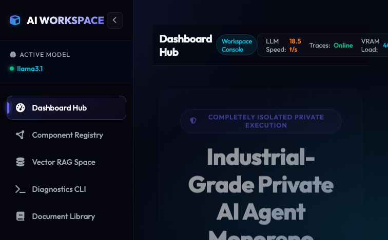
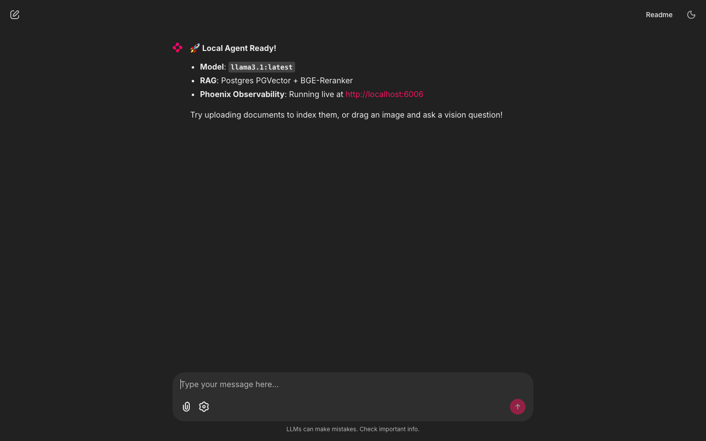
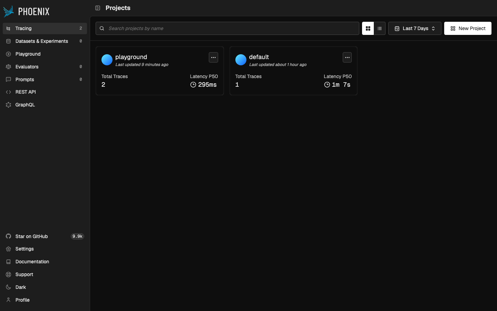
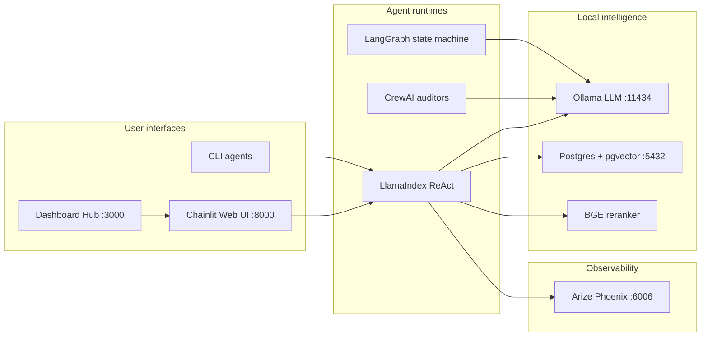

<p align="center">
  <strong>AI Agents Workspace</strong><br/>
  <em>A local-first monorepo for building, comparing, and operating private AI agents.</em>
</p>

<p align="center">
  <a href="#quick-start">Quick start</a> ·
  <a href="#screenshots">Screenshots</a> ·
  <a href="#architecture">Architecture</a> ·
  <a href="./RUNBOOK.md">Runbook</a> ·
  <a href="./llamaindex-agents/ARCHITECTURE.md">LlamaIndex design</a>
</p>

---

**AI Agents Workspace** is a production-minded playground for running multiple agent frameworks on your own machine—no cloud inference required. Spin up a unified dashboard, chat with a ReAct agent over your documents, trace every tool call, and run collaborative audits across **LlamaIndex**, **CrewAI**, and **LangGraph** from one `uv` workspace.

| | |
|---|---|
| **Privacy** | Models run locally via [Ollama](https://ollama.com); data stays on your Postgres instance |
| **RAG** | PGVector retrieval + BGE cross-encoder reranking |
| **Observability** | [Arize Phoenix](https://github.com/Arize-ai/phoenix) traces LLM, retrieval, and tool steps |
| **Frameworks** | Compare three agent stacks side-by-side in one repo |

---

## Screenshots

### Central Dashboard Hub (`localhost:3000`)

The landing hub is your control plane: live metrics, component registry, RAG status, and one-click links to every service.

<p align="center">
  
</p>

### LlamaIndex Chainlit Agent (`localhost:8000`)

Interactive ReAct chat with streaming, document ingestion, vision uploads, and in-chat model switching.

<p align="center">
  
</p>

### Arize Phoenix Tracing (`localhost:6006`)

Inspect traces, latency percentiles, and retrieval scores for every agent turn.

<p align="center">
  
</p>

> Screenshots captured from a running `make start` stack. Regenerate anytime with headless Chrome against the URLs above.

---

## Architecture



**Data flow (RAG chat):** user message → vector search in Postgres → cross-encoder rerank → Ollama completion → optional tool calls (calculator, web search, filesystem) → Phoenix trace export.

---

## Quick start

### Prerequisites

- **Python 3.11+** and [**uv**](https://docs.astral.sh/uv/)
- [**Ollama**](https://ollama.com) with `llama3.1` (or your chosen model)
- **PostgreSQL** with the `pgvector` extension (Docker recipe in [RUNBOOK.md](./RUNBOOK.md))

### Install & configure

```bash
# Clone and enter the repo
cd AI-Agents

# Install all workspace packages
uv sync

# Local secrets (never commit .env)
cp llamaindex-agents/.env.example llamaindex-agents/.env
# Edit: OPENAI_API_KEY (optional), POSTGRES_*, OLLAMA_*
```

### Boot everything

```bash
make start
```

| Service | URL | Purpose |
|---------|-----|---------|
| **Dashboard Hub** | http://localhost:3000 | Central navigation & docs |
| **Chainlit agent** | http://localhost:8000 | Primary chat UI |
| **Phoenix tracing** | http://localhost:6006 | LLM / RAG / tool telemetry |
| **Ollama API** | http://localhost:11434 | Local model inference |
| **Postgres** | `localhost:5432` | Vector store (`linearbits` by default) |

### Index your knowledge base

```bash
# Drop files into llamaindex-agents/data/
make ingest
```

### Stop services

```bash
make stop
```

For step-by-step Docker, Ollama, and troubleshooting guidance, see the [**Local AI Agent Runbook**](./RUNBOOK.md).

---

## What you can do

### LlamaIndex + Chainlit (`llamaindex-agents`)

- **ReAct agent** with tool use: calculator, DuckDuckGo search, workspace read/write, directory listing, system monitor
- **Two-stage RAG**: HuggingFace embeddings → PGVector → FlagEmbedding reranker
- **Drag-and-drop ingestion** for PDF, DOCX, Markdown, and plain text in chat
- **Multimodal vision** with `llava` / `llama3.2-vision` (switch models in Chat Settings)
- **CLI mode** with OpenAI or Ollama for lightweight terminal sessions

→ Deep dive: [llamaindex-agents/README.md](./llamaindex-agents/README.md) · [ARCHITECTURE.md](./llamaindex-agents/ARCHITECTURE.md)

### CrewAI (`crewai-agents`)

Multi-agent collaborative **codebase audit**—runs in the background on `make start` and writes `code_audit_report.md`.

```bash
make crewai-run
```

### LangGraph (`langgraph-agents`)

Stateful graph-based agent with local tools and hybrid OpenAI/Ollama routing.

```bash
make langgraph-run
```

### Shared utilities (`shared`)

Cross-package helpers consumed by all agent modules via the `uv` workspace.

---

## Repository layout

```
AI-Agents/
├── docs/screenshots/          # README visuals (landing, chainlit, phoenix)
├── llamaindex-agents/         # ReAct agent, Chainlit app, RAG ingestion
├── crewai-agents/             # Multi-agent codebase auditor
├── langgraph-agents/          # LangGraph state-machine agent
├── shared/                    # Shared Python utilities
├── server.py                  # Dashboard hub static server
├── index.html                 # Premium dashboard UI
├── Makefile                   # start, stop, ingest, dev, …
├── RUNBOOK.md                 # Full setup & operations guide
└── pyproject.toml             # uv workspace root
```

---

## Makefile reference

```bash
make help          # List all commands
make start         # Boot hub, Chainlit, Phoenix, CrewAI auditor
make stop          # Stop background services
make dev           # Chainlit with hot reload
make ingest        # Embed ./data into Postgres
make crewai-run    # Run CrewAI audit interactively
make langgraph-run # Run LangGraph agent
make ollama-pull   # Download default Ollama model
```

---

## Environment variables

Configure `llamaindex-agents/.env` (see [`.env.example`](./llamaindex-agents/.env.example)):

| Variable | Description |
|----------|-------------|
| `OPENAI_API_KEY` | Optional; enables cloud CLI agent |
| `OLLAMA_MODEL` | Default local model (e.g. `llama3.1`) |
| `OLLAMA_BASE_URL` | Ollama API endpoint |
| `POSTGRES_*` | PGVector database connection |

---

## Documentation map

| Document | Audience |
|----------|----------|
| [RUNBOOK.md](./RUNBOOK.md) | First-time setup, Docker, debugging |
| [llamaindex-agents/ARCHITECTURE.md](./llamaindex-agents/ARCHITECTURE.md) | Module design, RAG pipeline, diagrams |
| [llamaindex-agents/README.md](./llamaindex-agents/README.md) | LlamaIndex-specific commands |
| [llamaindex-agents/chainlit.md](./llamaindex-agents/chainlit.md) | In-app welcome & feature tips |

---

## Tech stack

| Layer | Tools |
|-------|-------|
| **Agents** | LlamaIndex, CrewAI, LangGraph |
| **UI** | Chainlit, custom dashboard (`index.html`) |
| **Models** | Ollama (local), OpenAI (optional CLI) |
| **Storage** | PostgreSQL + pgvector |
| **Embeddings / rerank** | `bge-small-en-v1.5`, FlagEmbedding reranker |
| **Tracing** | Arize Phoenix |
| **Packaging** | uv workspace monorepo |

---

<p align="center">
  <sub>Built for developers who want industrial-grade agent tooling without shipping data to the cloud.</sub>
</p>
