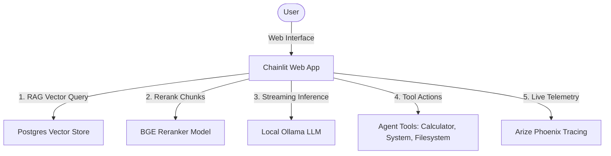

# 🧠 Local AI Agent System Mastery Runbook

Welcome to the **Local AI Agent System Mastery Runbook**! This guide is designed for developers, systems engineers, and AI enthusiasts who are setting up or exploring this private, local-first artificial intelligence workstation. 

This monorepo integrates **LlamaIndex**, **Ollama**, **PostgreSQL (PGVector)**, and **Arize Phoenix** to create an industrial-grade local ReAct agent environment capable of filesystem exploration, real-time RAG ingestion, system monitoring, and multimodal vision.



---

## 📋 Table of Contents
1. [Prerequisites & Core Systems](#1-prerequisites--core-systems)
2. [Step-by-Step Installation Guide](#2-step-by-step-installation-guide)
3. [Environment Configuration](#3-environment-configuration)
4. [Populating the Local Knowledge Base (RAG)](#4-populating-the-local-knowledge-base-rag)
5. [Running the Agent Workspace](#5-running-the-agent-workspace)
6. [Interactive Features Guide](#6-interactive-features-guide)
7. [Telemetry & Observability Dashboard](#7-telemetry--observability-dashboard)
8. [Troubleshooting & Maintenance](#8-troubleshooting--maintenance)

---

## 🛠️ 1. Prerequisites & Core Systems

Before starting, ensure your host machine is equipped with the following:
*   **Operating System**: macOS (Apple Silicon M1/M2/M3 highly recommended for fast local inference) or Linux.
*   **Package Manager**: `uv` (a blazing-fast Python resolver and package manager).
*   **Local LLM Service**: Ollama (handles quantization, loading, and streaming of open-source models).
*   **Database**: PostgreSQL equipped with the `pgvector` extension.
*   **Telemetry**: Arize Phoenix (runs locally in python to intercept and display tracer details).

---

## ⚙️ 2. Step-by-Step Installation Guide

### Step 2.1: Python Environment & Dependencies
We use Astral's `uv` package manager for instant resolution.
If `uv` is not globally installed, run:
```bash
curl -LsSf https://astral.sh/uv/install.sh | sh
```
Initialize the monorepo workspace dependencies:
```bash
# Run from workspace root to resolve all packages and cross-references
uv sync
```

### Step 2.2: Local Database Setup (Postgres + PGVector)
The agent retrieves files from a PostgreSQL vector store.
If you have Docker installed, the fastest way to start Postgres with the `pgvector` extension is:
```bash
docker run --name local-postgres \
  -e POSTGRES_DB=linearbits \
  -e POSTGRES_USER=postgres \
  -e POSTGRES_PASSWORD=postgres \
  -p 5432:5432 \
  -d pgvector/pgvector:pg16
```
*(Alternatively, you can install Postgres via Homebrew and run `CREATE EXTENSION vector;` in your SQL console).*

### Step 2.3: Ollama Installation & Setup
1.  **Download Ollama**: Download the native client from [Ollama's Official Website](https://ollama.com/download).
2.  **Start Background Daemon**:
    *   On macOS, open the Ollama app.
    *   Or run via terminal:
        ```bash
        make ollama-start
        ```
3.  **Verify Service Status**:
    Ensure the Ollama API is listening on port `11434`:
    ```bash
    curl http://localhost:11434
    # Expected: "Ollama is running"
    ```

---

## 📝 3. Environment Configuration

Copy the example configuration file to create your local `.env`:
```bash
cp llamaindex-agents/.env.example llamaindex-agents/.env
```
Open `llamaindex-agents/.env` and verify the values:
```ini
# Required if you want to run the OpenAI-based CLI agent
OPENAI_API_KEY=your-openai-api-key-here

# Local Ollama configuration
OLLAMA_MODEL=llama3.1
OLLAMA_BASE_URL=http://localhost:11434

# Postgres Vector DB connection parameters
POSTGRES_USER=postgres
POSTGRES_PASSWORD=postgres
POSTGRES_HOST=localhost
POSTGRES_PORT=5432
POSTGRES_DB=linearbits
```

---

## 📚 4. Populating the Local Knowledge Base (RAG)

The agent references a local Postgres vector database. You can populate it by running the batch ingestion tool:

1.  **Stage Documents**: Place files (e.g. documentation, notes, textbooks, code sheets) into the `llamaindex-agents/data/` folder.
2.  **Run Ingestion**:
    ```bash
    make ingest
    ```
    This script will automatically read all staging files, generate 384-dimensional dense vectors using a local HuggingFace Embedding model (`bge-small-en-v1.5`), and insert them into the Postgres table `knowledge_base_local`.

---

## 🚀 5. Running the Agent Workspace

You can audit the entire environment, start necessary services, download missing models, and boot the entire multi-agent workstation using **only one command**:
```bash
make start
```
This single target automates all startup processes:
1. **Auto-starts Postgres**: Checks localhost:5432 and automatically wakes up the Docker container (`docker start local-postgres`) if stopped.
2. **Auto-starts Ollama**: Checks the daemon and starts the service (`brew services start ollama` on macOS) if inactive.
3. **Auto-downloads Model**: Verifies if `llama3.1` is downloaded and automatically pulls it (`ollama pull llama3.1`) if missing.
4. **Launches Central Landing Dashboard (Background)**: Boots a local HTTP Server serving your **Interactive Systems Landing Page** (at 👉 [http://localhost:3000](http://localhost:3000)) in the background, redirecting stdout to `landing.log`.
5. **Launches LlamaIndex Web UI & Phoenix (Background)**: Boots the **Chainlit Web Server** (at 👉 [http://localhost:8000](http://localhost:8000)) and **Arize Phoenix Tracing** (at 👉 [http://localhost:6006](http://localhost:6006)) in the background, redirecting stdout to `chainlit.log`.
6. **Launches CrewAI Auditor (Background)**: Boots the **CrewAI Multi-Agent Auditor** in the background, redirecting stdout to `crewai.log`. It will audit the codebase and write `code_audit_report.md` at the monorepo root upon completion.
7. **Launches LangGraph CLI Agent (Foreground)**: Boots the stateful **LangGraph CLI Agent** directly in your terminal, allowing you to ask queries, monitor hardware resource load, or crawl folders interactively!

When you are ready to terminate the background processes (Landing page server, LlamaIndex server, and CrewAI auditor), run:
```bash
make stop
```
This will cleanly stop all background services.

---

## 🎯 6. Interactive Features Guide

Our local agent comes with premium, state-of-the-art features designed to make local model integration fluid and professional:

### ⚙️ 6.1. Dynamic Chat Settings (Bottom-Left Panel)
Click the settings cog in the Chainlit UI to configure components on-the-fly:
*   **Model Selection**: Dropdown lists all models currently downloaded on your system.
*   **Creative Sliders**: Adjust LLM `temperature` and customize `system_prompt` instructions.
*   **RAG Sliders**: Enable/disable database lookups, adjust the similarity lookup parameter `K`, or toggle local reranking (`BGE-reranker-base`) with a custom cutoff.

### 📥 6.2. Automatic Model Pulling
If you select a model in Chat Settings that you haven't downloaded yet (e.g., `mistral`, `gemma2` or `llava`), the agent **streams the download** directly in the Chat interface with a beautiful live ASCII progress bar:
`📥 Downloading model: [████████░░░░░░] 60% (2.4 GB / 4.1 GB)`

### 📁 6.3. Real-Time Document Upload Ingest
You don't need to run `make ingest` every time you get a new file! Just **drag and drop** `.pdf`, `.docx`, `.md`, or `.txt` files directly into the Chainlit chat bar. The agent will parse it, run embedding algorithms, and save the vectors to Postgres in real-time, giving you instant ingestion feedback!

### 👁️ 6.4. Multimodal Vision Support
Drag a PNG or JPEG image into the chat bar. If a vision-capable model (like `llava` or `llama3.2-vision`) is selected, the agent routes the image directly into Ollama's vision encoder and streams the description with complete latency diagnostics.

### 👥 6.5. Local Collaborative CrewAI Workspace
We have configured a fully-functional cooperative multi-agent workflow inside `crewai-agents`. It establishes a **Senior Software Engineer & System Explorer** agent and a **Lead Technical Auditor & Code Reviewer** agent that run 100% locally on Ollama:
*   **Sequential Pipeline**: The Explorer agent uses safe filesystem tools (`list_directory`, `read_file`) and `system_monitor` to crawl your code and query host system load.
*   **Cooperative Review**: The Reviewer agent analyzes the crawl transcript, performs an architectural audit, and writes a detailed markdown report named `code_audit_report.md` directly in your workspace root!
*   **Run command**:
    ```bash
    make crewai-run
    ```

### 🕸️ 6.6. Local Stateful LangGraph Agent
We have integrated a stateful, graph-based local agent workspace inside `langgraph-agents` using LangGraph and LangChain:
*   **Stateful Pipeline**: Uses a `StateGraph` compilation with a schema that tracks message history, step counts, and active tools.
*   **ReAct Loop Execution**: Dynamically routes execution between the `agent` reasoning node and `tools` execution node based on the model's tool calling decisions.
*   **Interactive Trace CLI**: When executed, it prints a real-time visual graph pipeline tracing active nodes (`[Node: agent]`, `[Node: tools]`, or conditional edge routing) along with detailed telemetry (latency, steps, and last tools used).
*   **Run command**:
    ```bash
    make langgraph-run
    ```

---

## 📊 7. Telemetry & Observability Dashboard

Telemetry is enabled natively. Every step the agent takes—including mathematical equations, database queries, and raw thoughts—is logged.

Open [http://localhost:6006](http://localhost:6006) in your browser:
*   **Trace Graphs**: Drill down into the exact call stacks of the ReAct agent loop.
*   **RAG Analysis**: Inspect the cosine similarity scores of retrieved database nodes and trace the subsequent cross-encoder reranking adjustments.
*   **Latency Metrics**: See where the bottleneck is (e.g. LLM prompt processing, embedding calculation, or database index scan times).

---

## 🛠️ 8. Troubleshooting & Maintenance

| Issue | Root Cause | Solution |
| :--- | :--- | :--- |
| **"Failed to connect to Postgres"** | PostgreSQL container or daemon is stopped. | Run `docker ps` to verify Postgres is running on port `5432`. Run `docker start local-postgres` to resume. |
| **"Ollama is not running"** | The Ollama background service is inactive. | Run `make ollama-start` (macOS) or ensure the application is open. |
| **Slow generations (Tokens/sec < 5)** | Local LLM is offloading layers to the CPU. | Ensure your model size fits your computer's RAM. 8GB unified RAM should stick to < 4B models (e.g. `phi3`), 16GB RAM is perfect for 7B-8B models (e.g. `llama3.1`). |
| **"Model not found"** | The target Ollama model is missing. | Use the Chat Settings panel to select a pulled model, or run `ollama pull <model>` in your terminal. |

### Essential Ollama CLI Commands
*   **List installed models**: `ollama list`
*   **Download a model**: `ollama pull <model-name>`
*   **Run a model locally**: `ollama run <model-name>`
*   **Remove a model**: `ollama rm <model-name>`

---

*Made with 🧠 and 💻 for developers building the next generation of private, open-source AI integrations.*
