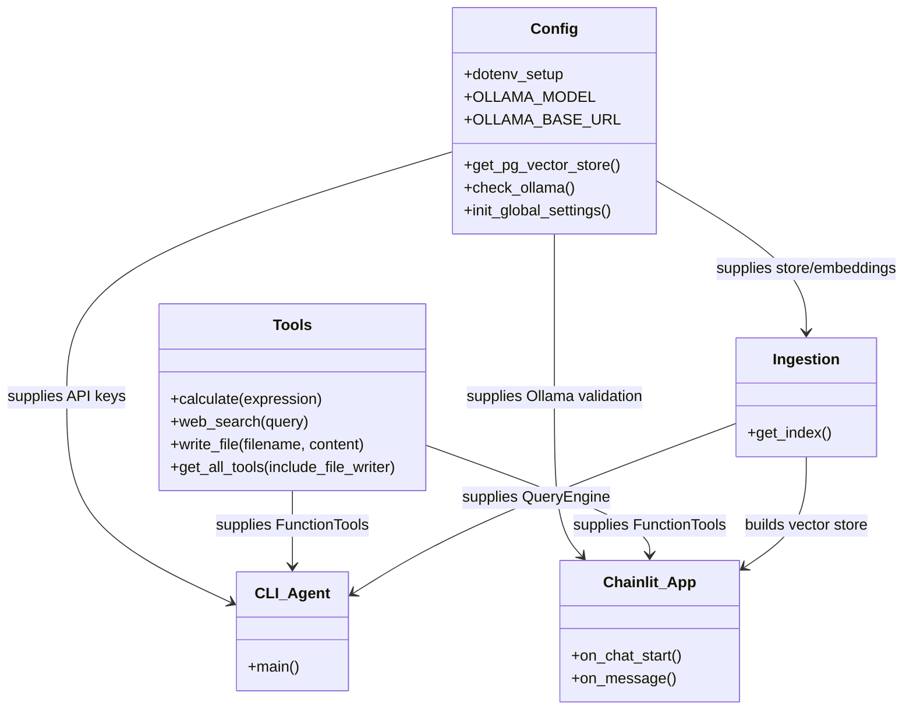
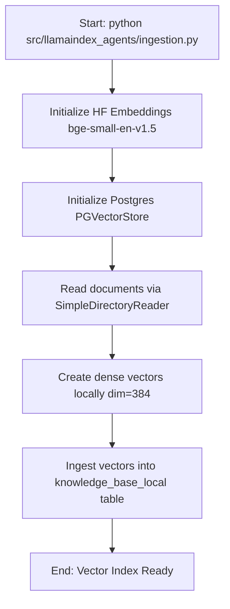
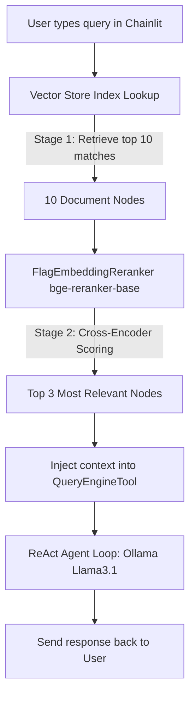
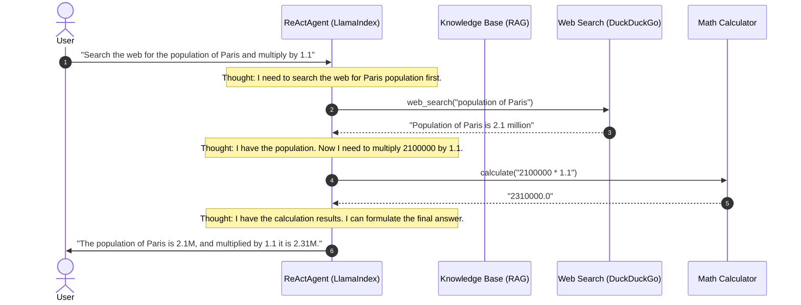

# LlamaIndex Agent Architecture

This document describes the design, module structure, and information flow of the refactored **LlamaIndex Agents** module within the multi-agent monorepo.

---

## 1. System Overview

The `llamaindex-agents` codebase is designed to run in two distinct runtimes:
1. **Cloud CLI Agent**: A lightweight command-line interface that utilizes the **OpenAI `gpt-4o-mini`** model for agent reasoning and a local Postgres vector store for RAG.
2. **Local Open-Source Agent (Chainlit Web UI)**: A full-featured interactive chat app utilizing the **Ollama `llama3.1`** model running locally, featuring **Arize Phoenix tracing/observability**, and a **two-stage local RAG pipeline** (retrieval via Postgres PGVectorStore + local cross-encoder reranking via FlagEmbedding).

---

## 2. Refactored Module Layout

To eliminate code duplication and adhere to the single-responsibility principle, the code has been reorganized into a modular, clean, and highly readable architecture:

### Module Descriptions
* **`config.py`**: Centralizes environment variables, directory paths, Postgres DB configuration, Ollama check tools, and sets the global HuggingFace embedding model (`BAAI/bge-small-en-v1.5`) across all runtimes.
* **`tools.py`**: Houses functional tool behaviors (safe simple calculation, DuckDuckGo web search, bounded local workspace writing) and packages them into LlamaIndex `FunctionTool` objects.
* **`ingestion.py`**: Handles building/updating the local vector database by reading document assets in the `./data/` folder, converting text to vectors using the global embeddings model, and saving them into Postgres.
* **`agent.py`**: Runs a classic ReAct agent loop in the terminal using cloud LLM capabilities and documents search.
* **`app.py`**: Starts the robust local agent runtime through Chainlit. It implements tracing, runs a two-stage local retrieval search, and hooks into Ollama.

---

## 3. Data Pipelines & Flow

### A. Document Ingestion Pipeline
Documents stored in the `./data/` directory are processed and saved into the local PostgreSQL vector database:

---

### B. Local Two-Stage RAG Pipeline (Chainlit Web UI)
The web runtime implements a premium **two-stage RAG pipeline** to ensure highly relevant context retrieval before sending queries to Ollama:

1. **Stage 1 (Retrieval)**: Performs a vector search over the Postgres PGVectorStore tables using HuggingFace cosine-similarity to retrieve the top 10 most candidate document nodes.
2. **Stage 2 (Reranking)**: Uses a local **Cross-Encoder Model (`BAAI/bge-reranker-base`)** to re-score and re-rank the candidate document nodes, selecting only the top 3 most relevant nodes to inject into the prompt context. This reduces context noise and ensures maximum precision in LLM synthesis.

---

## 4. ReAct Agent Loop

The agent utilizes the **Reasoning and Acting (ReAct)** paradigm to autonomously determine which tools to invoke to answer the user's questions:

---

## 5. Observability & Tracing

When running the Chainlit Web UI (`make dev`), **Arize Phoenix** tracing is launched automatically:
* Open http://localhost:6006 in your browser to view the Arize Phoenix Dashboard.
* Track the entire execution graph, including every LLM generation prompt, token usage, tool invocation latency, and document node chunk details in real time.
